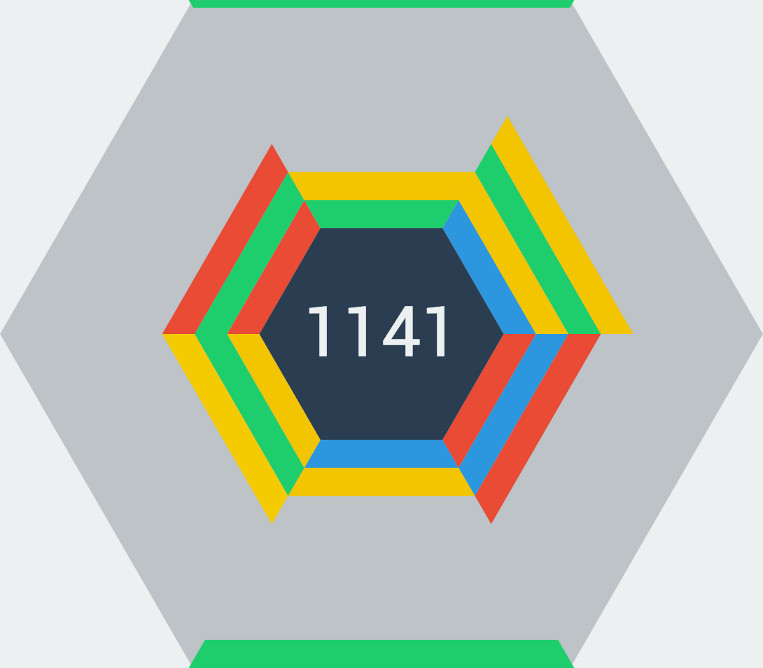

<!--
N.B.: This README was automatically generated by https://github.com/YunoHost/apps/tree/master/tools/README-generator
It shall NOT be edited by hand.
-->

# Hextris for YunoHost

[](https://dash.yunohost.org/appci/app/hextris)    
[](https://install-app.yunohost.org/?app=hextris)

*[Lire ce readme en français.](./README_fr.md)*

> *This package allows you to install Hextris quickly and simply on a YunoHost server.
If you don't have YunoHost, please consult [the guide](https://yunohost.org/#/install) to learn how to install it.*

## Overview

Rotate the Hexagon to prevent the blocks from stacking outside the outer grey hexagon!

HEXTRIS is a fast paced puzzle game inspired by Tetris. Blocks start on the edges of the screen, and fall towards the inner blue hexagon. The objective of the game is to prevent the blocks from stacking outside the area of the grey hexagon. To do this, you must rotate the hexagon to manage different stacks of blocks on each face. Aim to connect 3 or more blocks of the same color: when 3 or more blocks of the same color touch each other, they are destroyed, and the blocks above them slide down! Destroying multiple series of blocks grants combos, whose durations are indicated by a quickly receding outline around the outer, grey hexagon. You lose once blocks on a face of the hexagon stack outside of the outer hexagon!

**Shipped version:** 2020-05-05~ynh4

**Demo:** https://hextris.io/

## Screenshots



## Documentation and resources

* Official app website: http://hextris.github.io/
* Upstream app code repository: https://github.com/Hextris/Hextris
* YunoHost documentation for this app: https://yunohost.org/app_hextris
* Report a bug: https://github.com/YunoHost-Apps/hextris_ynh/issues

## Developer info

Please send your pull request to the [testing branch](https://github.com/YunoHost-Apps/hextris_ynh/tree/testing).

To try the testing branch, please proceed like that.
```
sudo yunohost app install https://github.com/YunoHost-Apps/hextris_ynh/tree/testing --debug
or
sudo yunohost app upgrade hextris -u https://github.com/YunoHost-Apps/hextris_ynh/tree/testing --debug
```

**More info regarding app packaging:** https://yunohost.org/packaging_apps